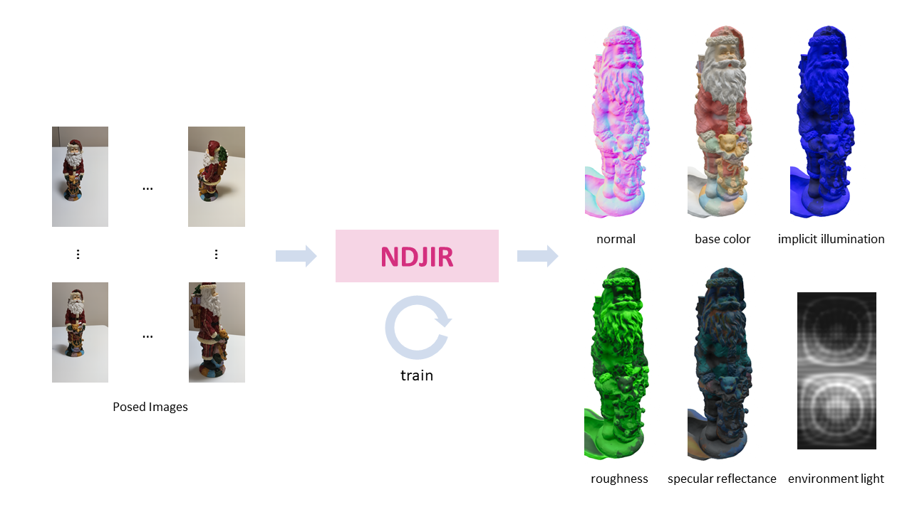

# NDJIR: Neural Direct and Joint Inverse Rendering

## [Paper](https://arxiv.org/abs/2302.00675)

Neural direct and joint inverse rendering (NDJIR) jointly decomposes an object in a scene into geometry (mesh), lights (environment light and implicit illumination), and materials (base color, roughness, and specular reflectance) given multi-view (posed) images. NDJIR directly uses the physically-based rendering equation, so we can smoothly import the decomposed geometry with materials into existing DCC tools.



| PBR | Base color (light-baked) | PBR (light-baked) |
| --- | ------------------------ | ----------------- |
|<video controls src="https://user-images.githubusercontent.com/29452506/207210980-df55644b-6980-47ad-b8f7-1ec016d6ec52.mp4"></video>|<video controls src="https://user-images.githubusercontent.com/29452506/207210998-eda360dd-0e82-46b3-9e06-a4d77696109b.mp4"></video>|<video controls src="https://user-images.githubusercontent.com/29452506/207211009-78db2c2c-ecc7-428c-aba6-8b47cef9ff14.mp4"></video>|
|<video controls src="https://user-images.githubusercontent.com/29452506/207211034-a27d370f-d630-45e6-9611-0a806355e808.mp4"></video>|<video controls src="https://user-images.githubusercontent.com/29452506/207211040-91f9a578-b002-4acc-84f2-52c1626cd9b0.mp4"></video>|<video controls src="https://user-images.githubusercontent.com/29452506/207211050-bd98f36f-d6d1-40d7-b842-c62130859d71.mp4"></video>|
|<video controls src="https://user-images.githubusercontent.com/29452506/207211084-671e97ac-cbc4-4865-b605-c151f47af38d.mp4"></video>|<video controls src="https://user-images.githubusercontent.com/29452506/207213414-1c50d80b-2ee3-403c-aa6b-f2814b30f20c.mp4"></video>|<video controls src="https://user-images.githubusercontent.com/29452506/207211124-e59e1d8f-f210-4ac8-9ea8-e88d8af21e7b.mp4"></video>|
   

## Table of Contents
1. [Training](#training)
2. [Evaluation](#evaluation)
3. [Physically-based Rendering](#physically-based-rendering)
4. [Custom Dataset](#custom-dataset)

## Training

We assume using DTUMVS dataset in [training](#training), but the usage is not limited to DTUMVS dataset. When using a custom_dataset, go to [Custom Dataset](#custom-dataset).

### Prepare Docker Image

```bash
export NNABLA_VER=1.29.0 \
    && docker build \
        --build-arg http_proxy=${http_proxy} \
        --build-arg NNABLA_VER=${NNABLA_VER} \
        -t ndjir/train \
        -f docker/Dockerfile .
```

### DTU MVS Dataset

Run the following command to download DTU MVS dataset.

```
wget https://www.dropbox.com/s/ujmakiaiekdl6sh/DTU.zip 
unzip DTU.zip
```

For the mesh evaluation, we rely on [this python script](https://github.com/jzhangbs/DTUeval-python), 
see the github [here](https://github.com/jzhangbs).

Download the reference datasets in [this page](https://roboimagedata.compute.dtu.dk/?page_id=36): 
- [SampleSet](http://roboimagedata2.compute.dtu.dk/data/MVS/SampleSet.zip)
- [Points](http://roboimagedata2.compute.dtu.dk/data/MVS/Points.zip)

Then, run the following commands:

```bash
mkdir DTUMVS_ref

unzip -r SampleSet.zip .
unzip -r Points.zip .

mv SampleSet Points DTUMVS_ref
```

### Train

```bash
python python/train.py --config-name default \
    device_id=0 \
    monitor_base_path=<monitor_base_path> \
    data_path=<path_to_DTU_scanNN>
```

[Mesh extraction](#mesh-extraction) and [its evaluation](#evaluation-mesh-as-geometry
) are included in the training.

### Mesh extraction

At the end of the training, the mesh is extracted using MarchingCubes with 512 grid size as default.
For explicitly extracting the mesh, set config and trained model properly, and then

```bash
python python/extract_by_mc.py \
    --config-path <results_path> \
    --config-name config \
    device_id=0 \
    model_load_path=<results_path>/model_01499.h5 \
    extraction.grid_size=512
```

The obj file is extracted in the <results_path>.

## Evaluation
### Evaluation (Mesh as geometry)

To evaluate the extracted mesh, run the following like

```bash
python python/evaluate_chamfer_dtumvs.py \
    --config-path <results_path> \
    --config-name config \
    valid.dtumvs.mesh_path=<path to extracted mesh> \
    valid.dtumvs.scan=scan<id> \
    valid.dtumvs.ref_dir=DTUMVS_ref \
    valid.dtumvs.vis_out_dir=<training_result_path>
    data_path=<data_path>
```

### Evaluation (Image space)

Set the config and trained model properly, then do neural rendering.

```bash
python python/render_image.py \
    device_id=0 \
    valid.n_rays=4000 \
    valid.n_down_samples=0 \
    model_load_path=<results_path>/model_01499.h5 \
    data_path=<data_path>
```

Now we have neural-rendered images. With these images, run like

```bash
python scripts/evaluate_rendered_images.py \
    -d_rd <neural_rendered_image_dir> \
    -d_gt <gt_image_dir> \
    -d_ma <gt_mask_dir>
```

## Physically-based Rendering

To PBR images, do the following steps.

1. Smooth mesh (optional)
2. Rebake light distribution (optional)
3. Create texture map
4. Create open3d camera parameters (optional)
5. View PBR-mesh

### Prepare Docker Image

```bash
docker build --build-arg http_proxy=${http_proxy} \
                -t ndjir/post \
                -f docker/Dockerfile.post .
```

### Postprocess

Run the script for smoothing mesh, rebaking light, and texturing:

```bash
bash run_all_postprocesses.sh <result_path> <model_iters> <trimmed or raw> <filter_iters>
```

### Create Open3D Camera Parameters

When using Open3D as a viewer, we can create O3D camera parameters based on cameras.npy:

```bash
python scripts/create_o3d_camera_parameters.py -f <path to cameras.npy>
```

### View PBR-Mesh

```bash
python scripts/viewer_pbr.py \
    -fc <base_color_mesh> \
    -fuv <triangle_uvs> \
    -fr <roughness_texture> \
    -fs <specular_reflectance_texture>
```

To save image only, add path to a camera parameter or directory containing those:

```bash
python scripts/viewer_pbr.py \
    -fc <base_color_mesh> \
    -fuv <triangle_uvs> \
    -fr <roughness_texture> \
    -fs <specular_reflectance_texture> \
    -c <o3d_camera_parameter>
```

## Custom Dataset

Pipeline for using custom dataset is as follows

1. Prepare images
2. Deblur images
3. Mask creation (i.e., background matting)
4. Estimate camera parameters
5. Normalize camera poses
6. Train with custom dataset for decomposition
7. Physically-based render

Instead of taking photos, we can use video of an object. Use [the batch script](./scripts/run_all_preprocesses.sh) to execute 1-5 above.

### Prepare Docker Image

```bash
docker build --build-arg http_proxy=${http_proxy} \
                -t ndjir/pre \
                -f docker/Dockerfile.pre .
```

### Preparation of Scene Dataset

Create the scene directory: 

```bash
mkdir -p <data_path>
```

Take videos and put those under '<data_path>'

**Tips**:
1. Take a video of an object around 360' view
2. Take two patterns: 0' and 45' to the ground
3. All parts of an object are included in an image or video
4. Keep slow move when taking video and/or use shake correction
5. Do not change a focal length so much
    
If taking photos of object(s), put all images to `<data_path>/image`, then run the script:

```bash
bash scripts/rename_images.sh <data_path>/image
```

### Preprocess

Run the script for extracting/deblurring images, creating masks, and estimating/normalizing camera parameters:

```bash
bash scripts/run_all_preprocesses.sh <data_path> <n_images:100> <single_camera:1> <colmap_use_mask:0>
```

### Train with Custom Data

```bash
python python/train.py --config-name custom \
    device_id=0 \
    monitor_base_path=<monitor_base_path> \
    data_path=<data_path>
```

Training takes about 3.5 hours using 100 images with an A100 GPU as default setting.

Now, we have geometry and spatially-varying materials, go to [Physically-based Rendering](#physically-based-renering).

## Citation

```
@misc{https://doi.org/10.48550/arxiv.2302.00675,
  url = {https://arxiv.org/abs/2302.00675},
  author = {Yoshiyama, Kazuki and Narihira, Takuya},  
  title = {NDJIR: Neural Direct and Joint Inverse Rendering for Geometry, Lights, and Materials of Real Object},
  year = {2023}
}
```
